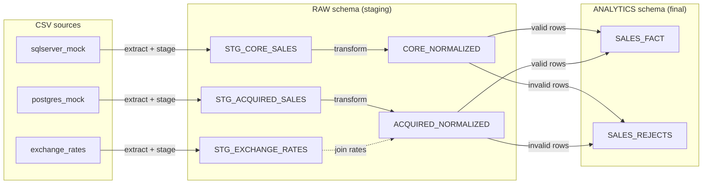

# Enterprise Data Integration Pipeline

A Python + SQL pipeline that merges sales from two sources — a core **SQL Server**
system and an acquired **PostgreSQL** system — into a unified, Snowflake-style
`SALES_FACT` table, with invalid rows quarantined in `SALES_REJECTS`.

Snowflake is the target warehouse, but the pipeline runs fully locally on
**DuckDB** (an embedded SQL engine) with **no credentials required** — DuckDB
stands in for Snowflake behind a common loader interface.

## Quick start

```bash
python -m venv .venv
source .venv/bin/activate
pip install -r requirements.txt

python main.py        # runs the pipeline, writes output CSVs, prints a summary
```

`main.py` reads the CSV fixtures, builds the fact and reject tables, and writes
them to `data/processed/output/`.

To target a real Snowflake account instead of DuckDB, set the backend and
credentials via environment variables (see `config/dummy.yml`):

```bash
export WAREHOUSE_BACKEND=snowflake
export SNOWFLAKE_ACCOUNT=... SNOWFLAKE_USER=... SNOWFLAKE_PASSWORD=...
python main.py
```

## Architecture

The pipeline is a four-stage flow against a swappable warehouse backend:



1. **Extract** — read each source CSV into a DataFrame.
2. **Stage** — load the raw frames into `RAW.STG_*` tables.
3. **Transform** — SQL scripts normalize each source (prefixed keys, JSON parsing,
   currency → USD, date normalization, SKU cleanup, duplicate detection) and flag
   invalid rows with a reject reason.
4. **Load** — valid rows are merged into `SALES_FACT`, rejected rows into
   `SALES_REJECTS`. The merge is idempotent, so re-running is safe.

The pipeline talks only to a `WarehouseLoader` interface, so DuckDB (local/tests)
and Snowflake (production) are interchangeable without changing pipeline code.

## Project layout

```text
de-data-integration/
├── main.py                       # entry point
├── config/
│   └── dummy.yml                 # paths + Snowflake credentials (from env vars)
├── data/
│   ├── raw/                      # source fixtures (CSV)
│   └── processed/                # expected-output fixtures (CSV)
├── src/
│   ├── config.py                 # config loading + backend selection
│   ├── pipeline.py               # orchestration: extract → stage → transform → load
│   ├── extractors/               # BaseExtractor contract + SQL Server / Postgres / CSV
│   ├── loaders/                  # WarehouseLoader interface, DuckDB + Snowflake, staging
│   ├── transformers/             # reusable SQL script runner
│   └── sql/                      # Snowflake-native transformation scripts
└── tests/                        # unit + end-to-end tests
```

## Tests

```bash
pytest
```

The suite runs entirely on DuckDB (no credentials). It includes unit tests for
the extractors and SQL runner, and an end-to-end test asserting the pipeline
output exactly matches `data/processed/expected_sales_fact.csv` and
`expected_rejects.csv`.
